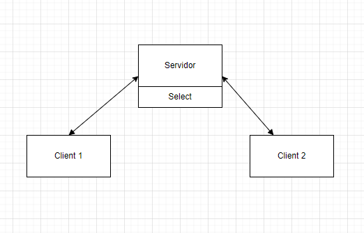

# chat_project
Projeto de pesquisa da matéria de Fundamentos de Redes de Computadores da Universidade de Brasília - Campus Gama.

## 1- Prepara Ambiente

Todo o projeto foi baseado no sistema operacional [Linux](https://ubuntu.com/download/desktop)

## 2-  Pre-requisitos

|   | Nome  | oque é?|
|--|----|---|
|**Sistema operacional** | [Linux](https://ubuntu.com/download/desktop) | sistemas operativos ou sistemas operacionais que utilizam o núcleo Linux.|
|**Compilador**          | [GCC]()   |  é um compilador: um programa que permite converter um ou mais arquivos-fonte escritos em C em um arquivo executável.|

##  3- Arquitetura

Diagrama que representa a arquitetura do projeto.




## 4- Comandos


| Comando | O que faz | Grupo |
|---------|-----------|-------|
| ``/create <nome_sala> `` | Cria uma nova sala  | Administrador, Client|
| ``/leave <nome_sala>`` | Sair de uma sala| Administrador, Client | 
| ``/join <índice_sala>``| Entra em uma sala existente| Administrador, Client|
| ``/list `` | Lista as salas disponíveis | Administrador, Client  |
| ``/users <índice_sala> ``  | Lista os participantes de uma sala | Administrador, Client |
| ``/remove_room <índice_sala> `` | Remove uma sala existente | Administrador |
| ``/remove_participant <índice_sala> <índice_participante>`` | Remove um participante de uma sala | Administrador  |
| ``/info``  | Mostra informações da plataforma e do usuário |  Administrador, Client  |
| ``/list_connections`` | Lista todos os usuarios conectados socket | Servidor |


## 5 Tutorial

### 5.1 Inicialize o servidor 

Compile o arquivo servidor.c

`` gcc servidor.c -o prog ``

Agora inicialize o servidor passando os seguintes paramentros, 

`` ./prog  <ip>   <port>``

por exemplo: `` ./prog 192.168.10.1 8000``

Com isso o ser servidor principal vai está rodando, você pode ultilzar o comando ``` /list_connections```

### 5.2 Conectar um client

Abra um novo terminal ou em outra maquina que esteja na mesma rede e use o comando

`` telnet <ip> <port> ``

com isso você pode usar todos os comandos listados na tabela do topico 4.